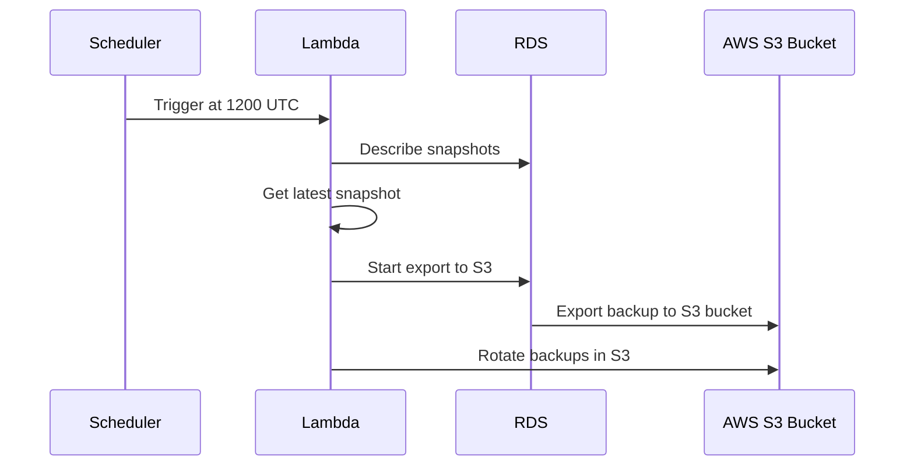

# trade-tariff-lambdas-database-backups

Scheduled go lambda function to backup the database to S3. This is used by
developers and various stakeholders to get access to current snapshots of
development, staging and production environments.

